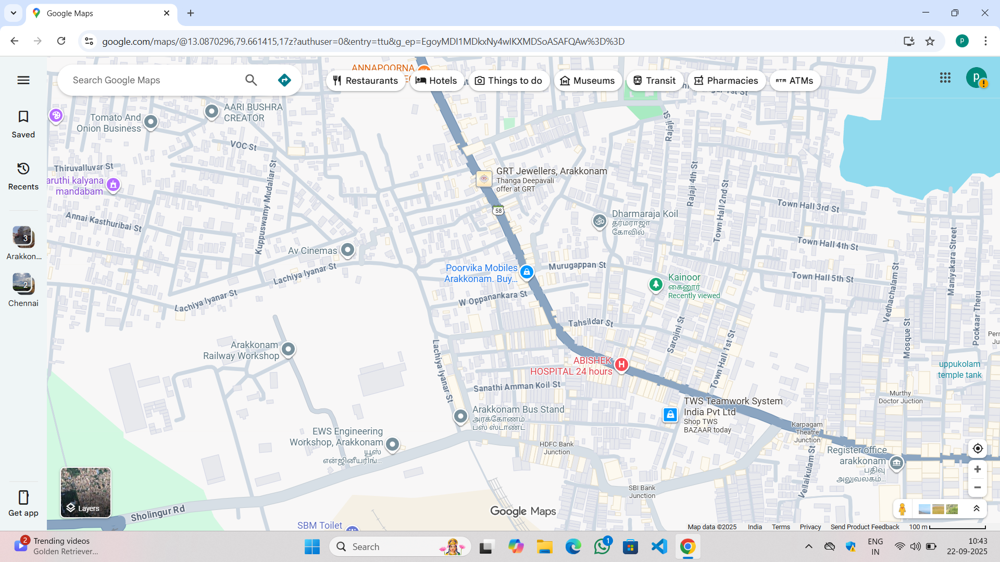
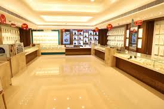
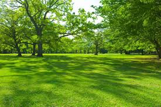
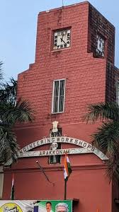

# Ex04 Places Around Me
## Date: 22.09.2025

## AIM
To develop a website to display details about the places around my house.

## DESIGN STEPS

### STEP 1
Create a Django admin interface.

### STEP 2
Download your city map from Google.

### STEP 3
Using ```<map>``` tag name the map.

### STEP 4
Create clickable regions in the image using ```<area>``` tag.

### STEP 5
Write HTML programs for all the regions identified.

### STEP 6
Execute the programs and publish them.

## CODE
```
static
home.html
!DOCTYPE html>
<html lang="en">
<head>
    <meta charset="UTF-8">
    <meta name="viewport" content="width=device-width, initial-scale=1.0">
    <title>Document</title>
</head>
<body>
    !-- Image Map Generated by http://www.image-map.net/ -->


<map name="image-map">
    <area target="" alt="kainoor park" title="kainoor park" href="kainoor.html" coords="1232,509,1395,573" shape="rect">
    <area target="" alt="arakkonam workshop" title="arakkonam workshop" href="workshop.html" coords="503,696,91" shape="circle">
    <area target="" alt="grt jewellers" title="grt jewellers" href="grt.html" coords="902,314,1051,309,1063,363,917,385" shape="poly">
</map>
</body>
</html>

grt.html

!DOCTYPE html>
<html lang="en">
<head>
    <meta charset="UTF-8">
    <meta name="viewport" content="width=device-width, initial-scale=1.0">
    <title>Document</title>
</head>
<body>
 
 Description:
 Name: GRT Jewellers (short for G. R. Thangamaligai)

Founded: In 1964 by Shri G. Rajendran in Chennai (then Madras), Tamil Nadu. 

Headquarters: T. Nagar / Usman Road, Chennai.
 
</body>
</html>

kainoor.html

<!DOCTYPE html>
<html lang="en">
<head>
    <meta charset="UTF-8">
    <meta name="viewport" content="width=device-width, initial-scale=1.0">
    <title>Document</title>
</head>
<body>
    

Description:
   Purpose: recreation, relaxation, nature exposure, social gathering. 

Can be urban (in cities/towns) or rural (countryside, wilderness).

Features often include:

Green spaces: lawns, trees, shrubs 

Walking/jogging paths, sitting benches

Playgrounds for children, and sometimes sport facilities.

workshop.html

DOCTYPE html>
<html lang="en">
<head>
    <meta charset="UTF-8">
    <meta name="viewport" content="width=device-width, initial-scale=1.0">
    <title>Document</title>
</head>
<body>
    
Description:

Here are some typical features of workshops (especially of the learning / collaborative kind):

Feature	Description
Objective	Clear goal(s): what outcome is expected (new skill learnt, plan made, problem solved).

Facilitation	Usually one or more facilitators who guide the workshop, manage time, encourage participation, keep the group on track.

Participation	Interactive: participants do more than listen — they discuss, practice, collaborate.

Hands-on / practical work	Often involves doing tasks, exercises, making something or prototyping or problem solving. 

Time-bounded	Fixed duration; can be a few hours to several days, but not open-ended courses. 

Group size	Relatively small enough for everyone to participate meaningfully; the size depends on the format. 

Resources and logistics	Needs suitable venue, tools/materials, possibly equipment, supplies; proper planning is required.    
</body>
</html>
```


## OUTPUT






## RESULT
The program for implementing image maps using HTML is executed successfully.
